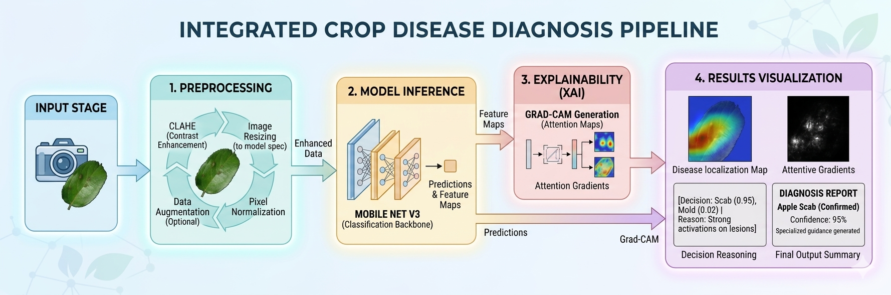
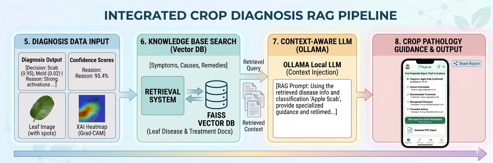
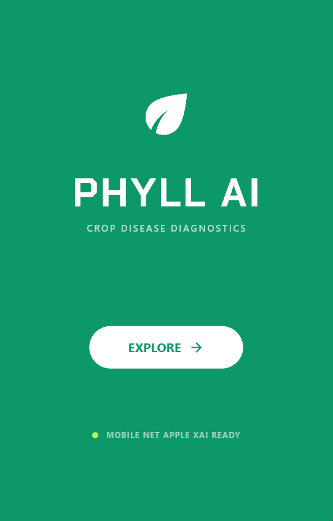
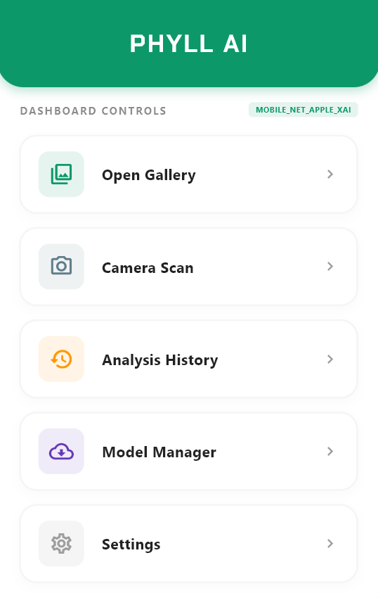
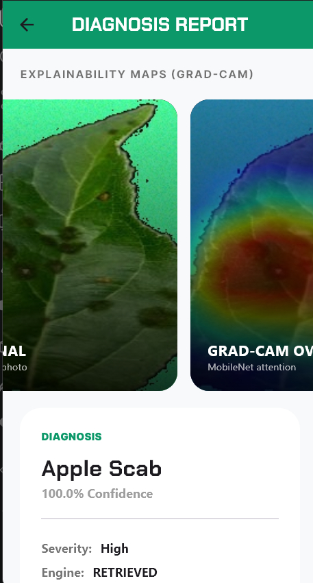
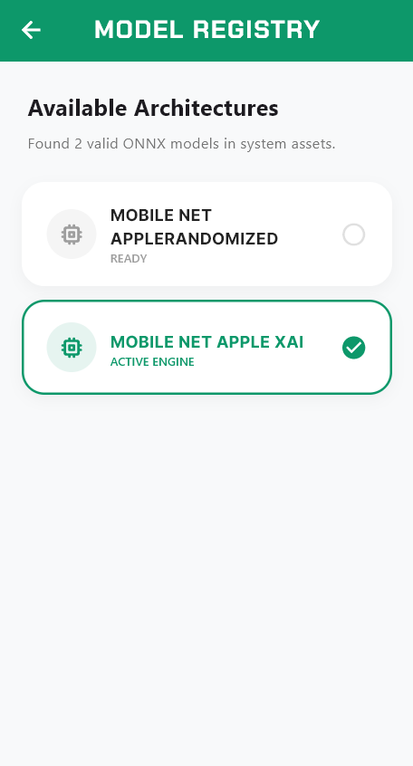
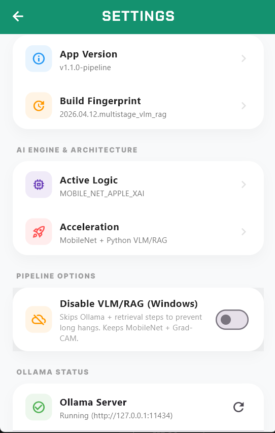

# PhyllAI

PhyllAI helps you diagnose crop leaf diseases from a photo and explains why it reached that conclusion. It can also generate practical, source-cited guidance using an offline/curated knowledge base.

---

## Highlights

- **Photo to diagnosis**: snap a leaf photo (or choose from gallery) and get a predicted disease class.
- **Explainability (XAI)**: visualize what regions influenced the prediction.
- **VLM Sandwich reasoning**: a two-stage vision-language approach (vision feature extraction + language reasoning) to produce human-readable, actionable output.
- **Source-cited RAG**: answers are grounded in retrieved documents and include citations so you can verify the guidance.
- **Edge-first by design**: runs locally during development; supports offline-friendly workflows.

---


### Normal input pipeline



### RAG pipeline (with citations)



---

## The VLM Sandwich

PhyllAI uses a layered approach to go from pixels -> evidence -> words:

- **Vision layer (feature extraction)**: encodes the leaf image into strong visual features (shape, texture, lesions, discoloration patterns).
- **Reasoning layer (language)**: turns those features + model signals into an explanation and next-step guidance.
- **Grounding layer (RAG)**: optionally retrieves relevant agronomy/plant-pathology notes and cites them in the final answer.

This makes the output more trustworthy than a raw label alone: you get a prediction, an explanation, and the supporting sources behind the recommendations.

---

## What you'll see in the app

- **Diagnosis result**: predicted disease/condition (and confidence if enabled).
- **XAI view**: heatmap/saliency overlay showing influential regions.
- **Guidance**: what to check next, mitigation steps, and prevention tips.
- **Citations**: a list of sources used for the RAG answer (titles/snippets and reference IDs/links depending on your knowledge pack).

---

## Screenshots

| Home | Dashboard | XAI | Model registry | Settings |
|---|---|---|---|---|
|  |  |  |  |  |

---

## Run locally (developers)

### Flutter

```bash
flutter pub get
flutter run
```

### Python companion (optional)

```bash
cd python
python -m venv .venv
source .venv/bin/activate  # macOS/Linux
# .venv\Scripts\activate  # Windows PowerShell
pip install -r requirements.txt
python server.py
```

---

## Privacy & safety notes

- Prefer local models/knowledge packs when handling sensitive farm data.
- Treat outputs as decision support, not a substitute for local agronomist guidance, especially for high-impact interventions.

---

## License

Add your license here (MIT/Apache-2.0/etc.).

